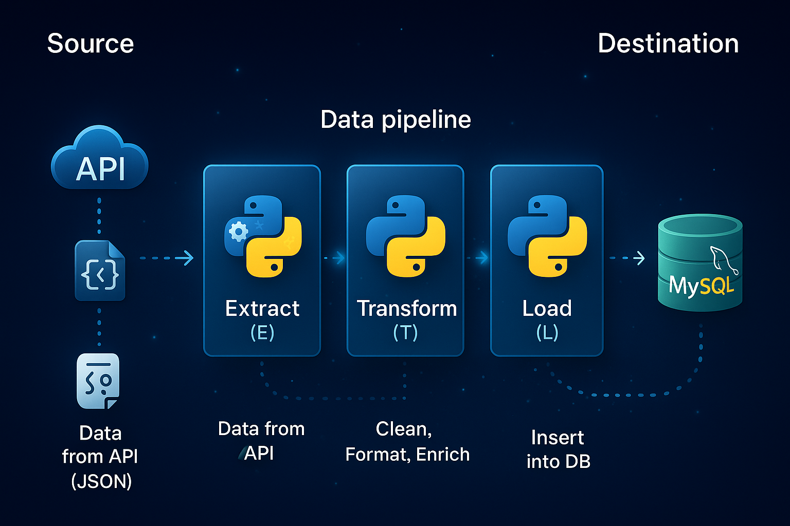

# StockSync

A simple **ETL data (Extract–Transform–Load) pipeline** built in Python.
It fetches **Ethereum (ETH) price data** from the Yahoo Finance API (via RapidAPI), transforms it using **pandas**, and loads it into a **MySQL database** for analysis.<br> <br>




---

## 📌 Features

* **Extract** real-time crypto price data from the [Yahoo Finance RapidAPI](https://rapidapi.com/manwilbahaa/api/yahoo-finance127).
* **Transform** raw API JSON into a clean, structured Pandas DataFrame.
* **Load** the transformed data into a MySQL table (`eth_prices`).
* Easy to extend for other cryptocurrencies or stock tickers.

---

## ⚙️ Tech Stack

* **Python 3.10+**
* **MySQL** (local or remote, tested with MySQL Workbench)
* **Libraries:**

  * `requests` — API calls
  * `pandas` — data wrangling
  * `mysql-connector-python` — database connection
  * `python-dotenv` — load secrets from `.env`

---

## 📂 Project Structure

```
ETLpy/
│── assets/
│   ├── ETLarch.png 
│── src/
│   ├── extract.py       # Fetch data from API
│   ├── transform.py     # Clean & format data
│   ├── load.py          # Create table + insert into MySQL
│   ├── pipeline.py      # Orchestrates the ETL flow
│── config/
│   └── database.py      # Database connection setup
│── .env                 
│── requirements.txt     
│── README.md
│── LICENSE
           
```

---

## 🔑 Environment Variables

Set up a `.env` file in the project root:

```ini
API_KEY=your_rapidapi_key_here
HOST=localhost
MYSQL_USERNAME=root
MYSQL_PASSWORD=your_password
MYSQL_DATABASE=ur_db
```

---

## 🚀 How to Run

1. **Clone the repo**

   ```bash
   git clone https://github.com/r-o-bo/StockSync.git
   cd ETLpy
   ```

2. **Install dependencies**

   ```bash
   pip install -r requirements.txt
   ```

3. **Run the pipeline**

   ```bash
   python -m src.pipeline
   ```

4. **Check your MySQL table**

   ```sql
   USE crypto_eth;
   SELECT * FROM eth_prices;
   ```
5. **Analyze data as you prefer**<br>
    Example queries:
   ```sql
   -- Maximum Price recorded
   SELECT MAX(price) AS max_price
   FROM eth_prices;

   -- Average price across all rows
   SELECT AVG(price) AS avg_price
   FROM eth_prices;

   -- Price changes greater than 4.1%
   SELECT symbol, price_change, percent_change, transformed_at
   FROM eth_prices
   WHERE price_change > 4.1
   ORDER BY transformed_at DESC;

   
   ```
---

## 📊 Schema

id (PK) | symbol  | name         | price   | price_change | percent_change | volume      | market_cap   | week_high | week_low  | logo | last_updated | transformed_at      |
----    | ------- | ------------ | ------- | ------------ | -------------- | ----------- | ------------ | --------- | --------- | ---- | ------------ | ------------------- |


---


## 📜 License

This project is licensed under the MIT License.

---
